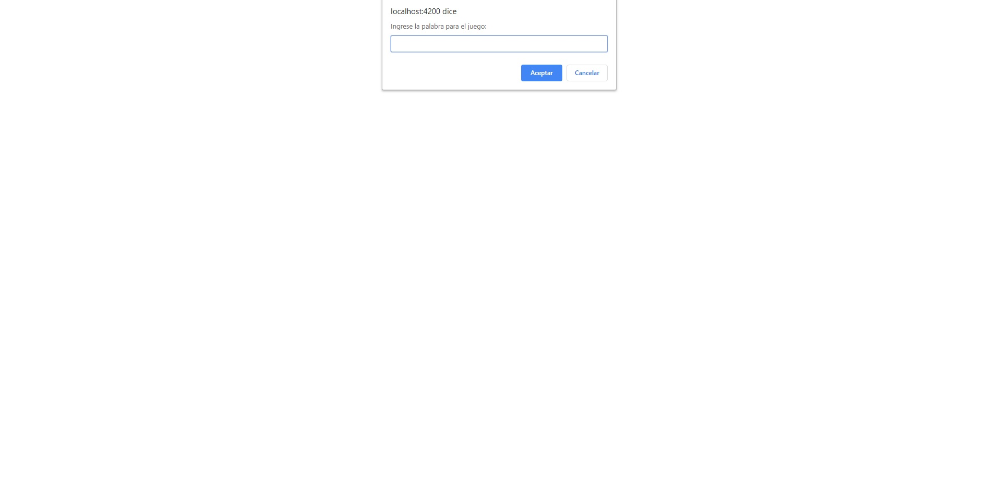
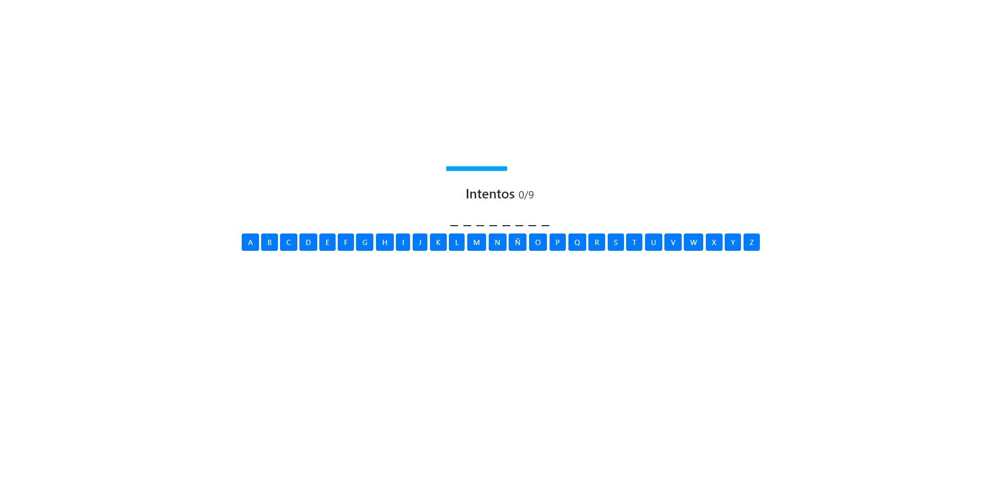
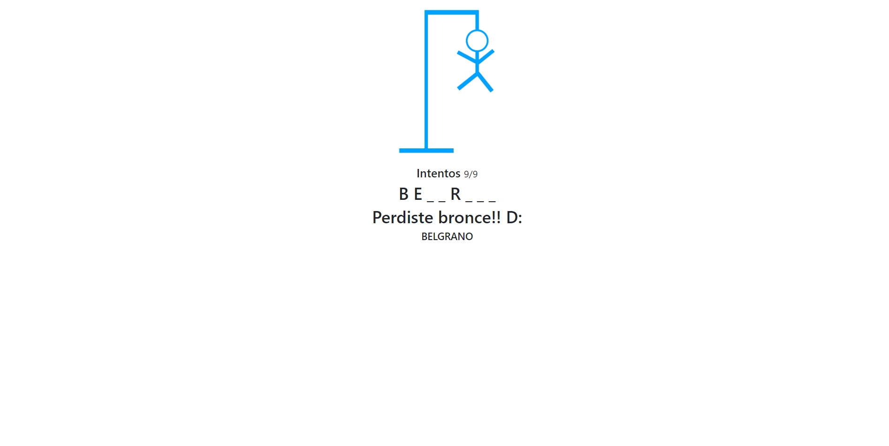

# Ahorcado

El juego del ahorcado, simple.
Creado con HTML5, CSS3 y JavaScript mediante Angular.

## Vistas dentro del juego

### Solicitud de palabra
 

### Juego
 

### Victoria
 

### Derrota
 
 
 
## Uso:
Despues de descargar el repositorio, a traves de la linea de comando ejecutar el siguiente script:

**npm install**

y luego:

**ng serve** 

o

**ng serve -o**

# **IMPORTANTE**
Tiene algunas cosas a mejorar, por ejemplo:
- Los espacios no los reconoce, ahora que lo estoy subiendo me doy cuenta. Mas adelante lo corregire.
- Al terminar el juego, lo ideal, seria que recargue, despues de un lapso, la página para empezar otro juego.
